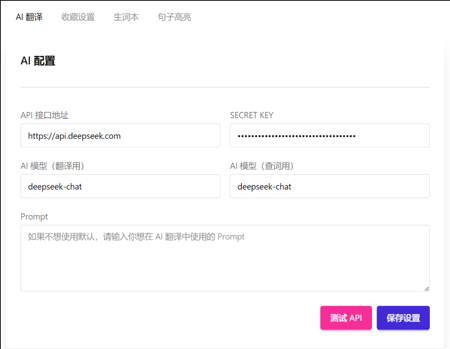
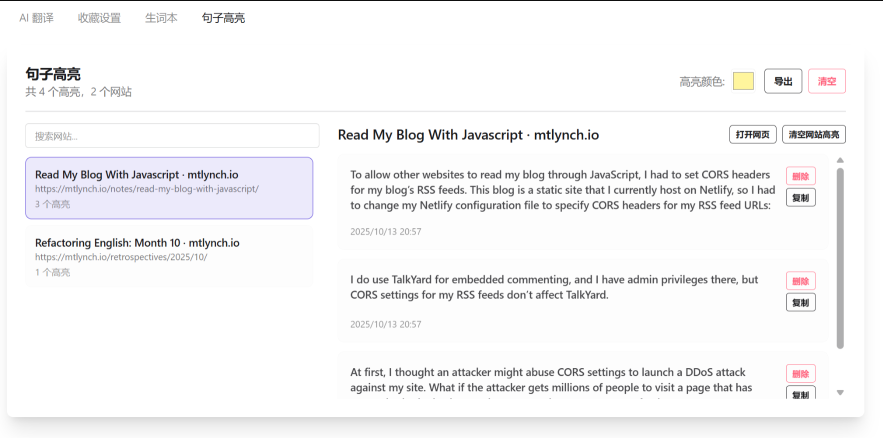

# for-simple-read

for-simple-read 是一款浏览器扩展插件，旨在帮助英语学习者更高效地阅读英文文章。它集成了查词、翻译和高亮文本等功能，让您无需离开当前网页就能完成所有阅读操作。

## 📦 安装方式

### 手动安装

1. 从 [发布页面](https://github.com/x1uc/for-simple-read/releases) 下载最新版本（提供了Chromium版本和Firfox版本）
2. 解压下载的文件
3. 打开 Chrome 浏览器，访问 `chrome://extensions/`（Firfox为`about:addons`）
4. 在右上角启用"开发者模式"
5. 点击"加载已解压的扩展程序"，选择解压后的文件夹
6. 插件应该会出现在您的浏览器中
7. 点击插件图标后，进入配置也进行配置

## ✨ 功能特性

### 🔍 查词

- **上下文查词**：查词时会将单词的上下文传递给LLM，保证释义准确
- **高亮单词**：查询后的单词会自动高亮，并缓存结果以提高查询速度
- **收藏单词**：支持将单词收藏到欧路词典，并附带上下文语境，方便记忆

### 🔄 翻译

- **自定义窗口位置**：翻译窗口的位置可以自定义&可以Pin翻译窗口

### 🖍️ 文本高亮

- **句子高亮**：标记重要句子，方便后续复习
- **轻松回顾**：可以在Option页面访问高亮记录

### ⚙️ 配置管理

- **AI 配置**：基于大语言模型的查词和翻译功能
- **收藏设置**：配置生词收藏服务的令牌
- **生词本**：记录收藏的单词列表，支持导出.txt文件
- **句子高亮**：句子高亮记录

---

**注意**：本项目目前处于开发阶段。某些功能可能受限或正在改进中。如果你对项目有不满意的地方可以提交issue。

如果您觉得这个插件有帮助，请在给它一个 ⭐！
